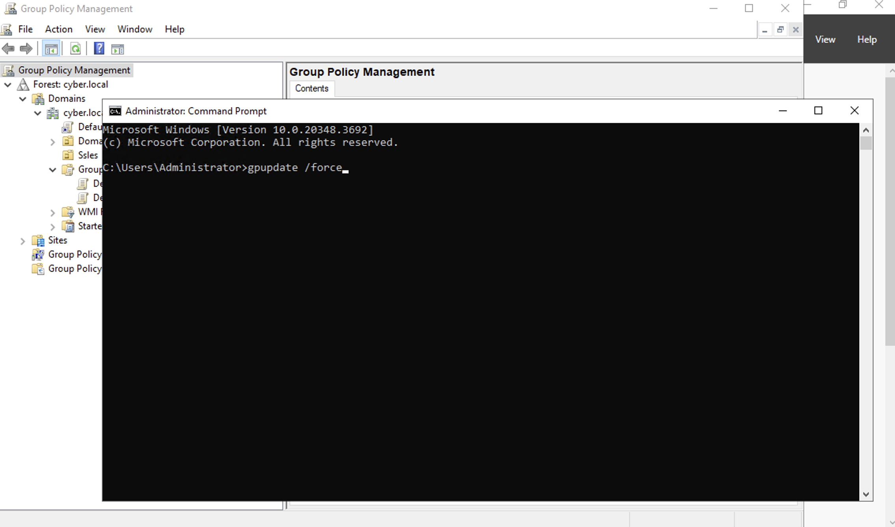

# How to Enforce Policy Changes👮‍♂️
-This lab illustrates how to enforce GPO **Policy Changes**
### Enforcing Policy Changes
- For policy changes to take effect, you need to open **Command Prompt** and run the **gpupdate /force** command

## Demo Video🎥
- [Enforcing GPO's](https://www.loom.com/share/9e75ad6283b648f1a486e30b2b3dd31e?sid=f382fe8a-4d12-4dca-8c89-01178ad66035)
